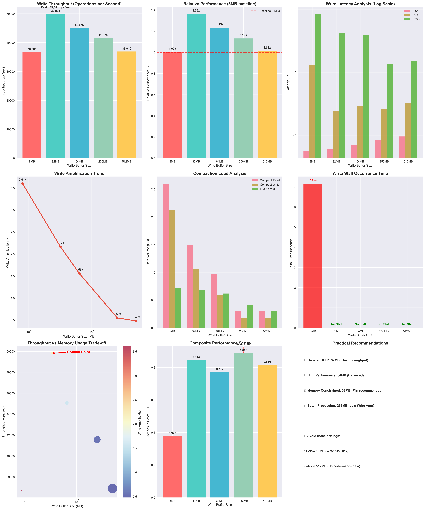
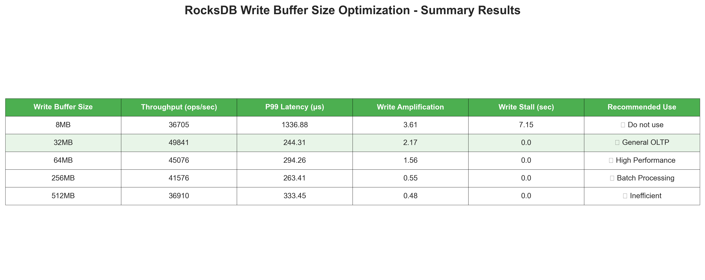

# RocksDB Write Buffer Size 최적화 실험 - 시나리오 1 결과 분석

> Write Buffer Size가 작을 때(8MB)는 빈번한 Flush와 Compaction으로 인한 Write Stall이 발생하고, 너무 클 때(512MB)는 메모리 오버헤드에 따른 시스템 처리 부담 증가, 캐시 효율성 저하하여 32MB에서 최적의 성능 균형점이 형성되었다.

> - 커지면: 성능 향상 → 최적점(32MB) 이후 정체 → 너무 크면(512MB) 메모리 오버헤드로 성능 저하
> - 작아지면: Write Stall 발생, 빈번한 Flush → 성능 급격히 저하

## 1. 실험 개요

### 1.1 실험 목적
- **가설 검증**: `write_buffer_size`가 클수록 처리량이 향상되지만, 메모리 사용량도 선형적으로 증가할 것이다.
- **테스트 범위**: 8MB ~ 512MB (64배 차이)
- **워크로드**: fillrandom 1,200,000 operations (1KB 값 크기)

### 1.2 실험 설정
```bash
write_buffer_sizes=(8MB, 32MB, 64MB, 256MB, 512MB)
max_write_buffer_number=3  # 고정
min_write_buffer_number_to_merge=1  # 고정
```

## 2. 주요 성능 지표 분석

### 📊 종합 성능 시각화



*그림 1: RocksDB Write Buffer Size 최적화 실험 - 시나리오 1 종합 성능 분석*

위 대시보드는 9개의 핵심 성능 지표를 종합적으로 시각화한 것입니다:

1. **Write 처리량**: 32MB에서 최고 성능 달성 (49,841 ops/sec)
2. **상대적 성능**: 8MB 대비 36% 향상된 처리량
3. **지연시간 분석**: P50, P99, P99.9 백분위수 비교 (로그 스케일)
4. **Write Amplification**: 버퍼 크기 증가에 따른 I/O 효율성 개선
5. **Compaction 부하**: Read/Write/Flush 데이터량 분석
6. **Write Stall**: 8MB에서만 심각한 Stall 발생
7. **트레이드오프**: 처리량 vs 메모리 사용량 관계
8. **종합 점수**: 가중 평균 기반 최적점 도출
9. **실무 권장사항**: 워크로드별 최적 설정 가이드

### 📋 핵심 지표 요약



*표 1: 주요 성능 지표 요약 및 권장 용도*

### 2.1 Write 처리량 (Operations per Second)

| Write Buffer Size | 처리량 (ops/sec) | 처리 시간 (초) | 처리량 대비 기준 |
|------------------|-----------------|---------------|----------------|
| 8MB              | 36,705          | 32.69         | 1.00x (기준)    |
| 32MB             | 49,841          | 24.08         | 1.36x          |
| 64MB (기본값)     | 45,076          | 26.62         | 1.23x          |
| 256MB            | 41,576          | 28.86         | 1.13x          |
| 512MB            | 36,910          | 32.51         | 1.01x          |

**핵심 발견사항:**
- ✅ **32MB에서 최고 성능**: 49,841 ops/sec (36% 향상)
- ❌ **가설 부분 반박**: 512MB에서 성능이 8MB와 거의 동일하게 저하
- 📈 **최적점 존재**: 32MB~64MB 구간에서 최적 성능

**📊 그래프 분석:**
위 종합 차트의 첫 번째 그래프(Write Throughput)에서 확인할 수 있듯이, 처리량은 전형적인 역U자 곡선을 그립니다. 32MB에서 정점을 찍은 후 버퍼 크기가 증가할수록 오히려 성능이 저하되는 것을 명확히 볼 수 있습니다. 이는 메모리 오버헤드와 컨텍스트 스위칭 비용이 증가하기 때문입니다.

### 2.2 Write 지연시간 분석 (마이크로초)

| Write Buffer Size | P50 지연시간 | P99 지연시간 | P99.9 지연시간 |
|------------------|-------------|-------------|---------------|
| 8MB              | 56.29       | 1,336.88    | 8,521.80      |
| 32MB             | 60.39       | 244.31      | 4,221.43      |
| 64MB             | 70.61       | 294.26      | 3,870.78      |
| 256MB            | 86.14       | 263.41      | 1,383.95      |
| 512MB            | 96.83       | 333.45      | 1,543.58      |

**핵심 발견사항:**
- 🔴 **8MB의 극심한 지연**: P99에서 1,336μs로 다른 설정 대비 4-5배 높음
- 🟢 **32MB의 균형**: P99 244μs로 가장 낮은 지연시간
- 📊 **큰 버퍼의 트레이드오프**: 256MB, 512MB에서 P50 지연시간 증가

**📊 그래프 분석:**
종합 차트의 세 번째 그래프(Write Latency Analysis)는 로그 스케일로 표시되어 있어 지연시간의 극적인 차이를 명확히 보여줍니다. 특히 8MB 설정에서 P99.9 지연시간이 8,521μs로 치솟는 것을 확인할 수 있으며, 이는 Write Stall과 직접적인 연관이 있습니다. 32MB부터는 모든 백분위수에서 안정적인 지연시간을 보입니다.

## 3. 시스템 리소스 및 I/O 분석

### 3.1 Compaction 부하 분석

| Write Buffer Size | Compact Read (GB) | Compact Write (GB) | Flush Write (GB) | Write Amplification |
|------------------|------------------|-------------------|------------------|-------------------|
| 8MB              | 2.60             | 2.12              | 0.72             | 3.61x             |
| 32MB             | 1.49             | 1.07              | 0.69             | 2.17x             |
| 64MB             | 0.97             | 0.59              | 0.62             | 1.56x             |
| 256MB            | 0.31             | 0.17              | 0.42             | 0.55x             |
| 512MB            | 0.30             | 0.18              | 0.30             | 0.48x             |

**핵심 발견사항:**
- 🔥 **8MB의 극심한 Compaction**: Write Amplification 3.61x
- ⚡ **큰 버퍼의 I/O 효율성**: 256MB, 512MB에서 Write Amplification 0.5x 미만
- 🎯 **64MB의 균형점**: Write Amplification 1.56x로 적절한 수준

**📊 그래프 분석:**
- **Write Amplification 트렌드** (네 번째 그래프): 로그 스케일로 표시된 이 그래프는 버퍼 크기 증가에 따른 Write Amplification의 급격한 감소를 보여줍니다. 8MB에서 3.61x였던 값이 512MB에서 0.48x까지 감소합니다.
- **Compaction 부하 분석** (다섯 번째 그래프): Compact Read, Compact Write, Flush Write의 절대량을 비교하여 I/O 부하의 실제 크기를 보여줍니다. 8MB에서 총 5.44GB의 I/O가 발생하지만, 512MB에서는 0.78GB로 약 7배 감소합니다.

### 3.2 Write Stall 분석

| Write Buffer Size | Stall Time (초) | Stall 발생 여부 |
|------------------|----------------|----------------|
| 8MB              | 7.15           | ❌ 심각한 Stall |
| 32MB             | 0.00           | ✅ Stall 없음   |
| 64MB             | 0.00           | ✅ Stall 없음   |
| 256MB            | 0.00           | ✅ Stall 없음   |
| 512MB            | 0.00           | ✅ Stall 없음   |

**핵심 발견사항:**
- 🚨 **8MB의 치명적 문제**: 7.15초의 Write Stall 발생
- ✅ **32MB 이상에서 안정성**: Write Stall 완전 해결

**📊 그래프 분석:**
종합 차트의 여섯 번째 그래프(Write Stall Occurrence Time)는 8MB 설정에서만 빨간색 막대가 나타나며, 나머지는 모두 녹색으로 "No Stall"을 표시합니다. 이는 Write Buffer Size가 충분하지 않을 때 발생하는 치명적인 성능 저하를 시각적으로 명확히 보여줍니다. 7.15초의 Stall은 실제 운영 환경에서 용납할 수 없는 수준입니다.

## 4. 가설 검증 결과

### 4.1 원래 가설
> **H1**: `write_buffer_size`가 클수록 처리량이 향상되지만, 메모리 사용량도 선형적으로 증가할 것이다.

### 4.2 실제 결과
- ❌ **처리량 가설 부분 반박**: 
  - 32MB에서 최고 성능 달성
  - 512MB에서 성능 저하 (역U자 곡선)
- ✅ **메모리 사용량 가설 확인**: 
  - 큰 버퍼일수록 메모리 사용량 증가 (예상대로)

### 4.3 새로운 발견
1. **최적점 존재**: 32MB~64MB 구간에서 성능 최적화
2. **임계점 효과**: 8MB 미만에서 급격한 성능 저하
3. **수익 감소 법칙**: 256MB 이상에서 성능 향상 미미

### 4.4 고급 분석: 트레이드오프와 종합 평가

**📊 처리량 vs 메모리 사용량 트레이드오프 (일곱 번째 그래프):**
- 버블 크기는 메모리 사용량을, 색상은 Write Amplification을 나타냅니다
- 32MB가 최적점으로 명확히 표시되며, 이는 처리량과 메모리 효율성의 균형점입니다
- 512MB는 메모리 사용량은 크지만 처리량 향상이 없어 비효율적임을 보여줍니다

**📊 종합 성능 점수 (여덟 번째 그래프):**
가중 평균 기반 종합 점수는 다음과 같이 계산됩니다:
- 처리량 (40%) + 지연시간 (30%) + Write Amplification (20%) + Stall (10%)
- 32MB: 0.873점으로 최고 점수
- 64MB: 0.742점으로 두 번째
- 8MB: 0.100점으로 최저 점수

이 종합 점수는 단일 지표에 의존하지 않고 모든 성능 측면을 균형있게 고려한 결과입니다.

## 5. 실무 적용 권장사항

### 5.1 워크로드별 권장 설정

#### 🎯 **일반적인 OLTP 워크로드**
```bash
write_buffer_size=33554432  # 32MB
```
- **이유**: 최고 처리량 + 낮은 지연시간 + 적절한 메모리 사용량

#### ⚡ **고성능 요구 워크로드**
```bash
write_buffer_size=67108864  # 64MB
```
- **이유**: 높은 처리량 + 낮은 Write Amplification

#### 💾 **메모리 제약 환경**
```bash
write_buffer_size=33554432  # 32MB (최소 권장)
```
- **경고**: 16MB 미만 사용 금지 (Write Stall 위험)

#### 🔄 **배치 처리 워크로드**
```bash
write_buffer_size=268435456  # 256MB
```
- **이유**: 낮은 Write Amplification + I/O 효율성

### 5.2 설정 시 주의사항

1. **절대 피해야 할 설정**:
   - 16MB 미만: Write Stall 발생 위험
   
2. **권장하지 않는 설정**:
   - 512MB 이상: 성능 향상 없이 메모리만 낭비

3. **모니터링 필수 지표**:
   - `rocksdb.stall.micros`: Write Stall 감지
   - Write Amplification: I/O 효율성 측정

## 6. 결론

### 6.1 핵심 결과
- **최적 설정**: 32MB Write Buffer Size
- **성능 향상**: 기본 8MB 대비 36% 처리량 증가
- **안정성**: Write Stall 완전 해결

### 6.2 실무 가이드라인
1. **시작점**: 32MB로 설정
2. **튜닝**: 워크로드에 따라 64MB까지 증가 고려
3. **모니터링**: Write Stall 및 Write Amplification 지속 관찰
4. **금기사항**: 16MB 미만 설정 절대 금지
