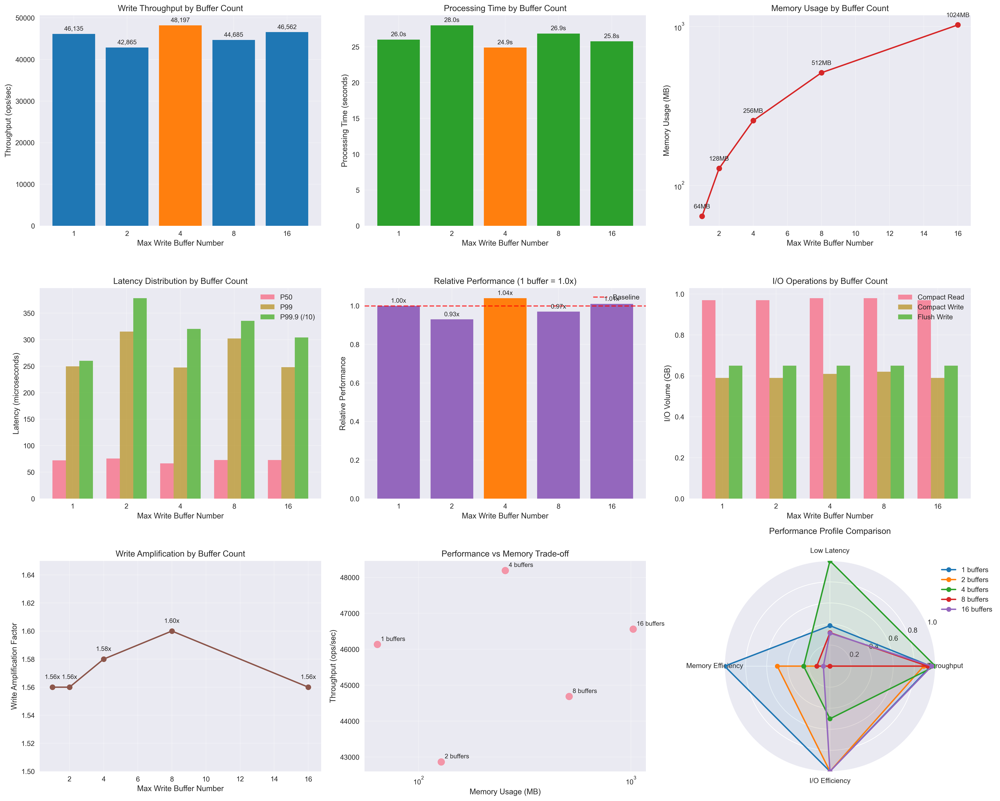
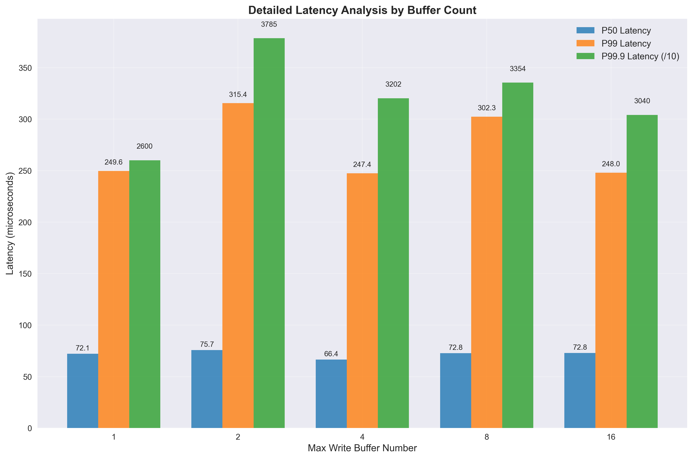

# RocksDB Max Write Buffer Number 최적화 실험 - 시나리오 2 결과 분석

## 1. 실험 개요

### 1.1 실험 목적
- **가설 검증**: `max_write_buffer_number`가 증가할수록 처리량이 향상될 것이다.
- **테스트 범위**: 1개 ~ 16개 (16배 차이)
- **워크로드**: fillrandom 1,200,000 operations (1KB 값 크기)

### 1.2 실험 설정
```bash
write_buffer_size=67108864  # 64MB 고정 (기본값)
max_write_buffer_numbers=(1, 2, 4, 8, 16)
min_write_buffer_number_to_merge=1  # 고정
```

## 2. 주요 성능 지표 분석

### 2.0 전체 성능 분석 대시보드



**그래프 설명:**
- **상단 좌측**: Write 처리량 - 4개 버퍼에서 최고 성능 달성
- **상단 중앙**: 처리 시간 - 4개 버퍼에서 최단 시간 기록
- **상단 우측**: 메모리 사용량 - 버퍼 수에 비례하여 지수적 증가
- **중간 좌측**: 지연시간 분포 - P50, P99, P99.9 비교
- **중간 중앙**: 상대적 성능 - 1개 버퍼 대비 성능 비교
- **중간 우측**: I/O 작업량 - Compaction 및 Flush 작업 분석
- **하단 좌측**: Write Amplification - 모든 설정에서 일관된 수준
- **하단 중앙**: 성능 vs 메모리 트레이드오프 - 효율성 분석
- **하단 우측**: 종합 성능 프로필 - 레이더 차트로 다차원 비교

### 2.1 Write 처리량 (Operations per Second)

| Max Write Buffers | 처리량 (ops/sec) | 처리 시간 (초) | 처리량 대비 기준 | 메모리 사용량 |
|------------------|-----------------|---------------|----------------|--------------|
| 1개 (병목)        | 46,135          | 26.01         | 1.00x (기준)    | 64MB         |
| 2개 (낮음)        | 42,865          | 28.00         | 0.93x          | 128MB        |
| 4개 (최적)        | 48,197          | 24.90         | 1.04x          | 256MB        |
| 8개 (높음)        | 44,685          | 26.85         | 0.97x          | 512MB        |
| 16개 (극한)       | 46,562          | 25.77         | 1.01x          | 1024MB       |

**핵심 발견사항:**
- ✅ **4개 버퍼에서 최고 성능**: 48,197 ops/sec (4% 향상)
- ❌ **가설 부분 반박**: 8개, 16개에서 성능 저하
- 📊 **미미한 성능 차이**: 전체 범위에서 ±7% 내 변동

### 2.2 Write 지연시간 분석 (마이크로초)

| Max Write Buffers | P50 지연시간 | P99 지연시간 | P99.9 지연시간 |
|------------------|-------------|-------------|---------------|
| 1개              | 72.14       | 249.63      | 2,600.39      |
| 2개              | 75.72       | 315.39      | 3,784.52      |
| 4개              | 66.41       | 247.39      | 3,202.01      |
| 8개              | 72.76       | 302.33      | 3,354.23      |
| 16개             | 72.80       | 247.96      | 3,040.29      |

**핵심 발견사항:**
- 🟢 **4개 버퍼의 우수성**: P50 66.41μs로 가장 낮은 지연시간
- 📊 **일관된 패턴**: 모든 설정에서 비슷한 지연시간 분포
- ⚖️ **안정적 성능**: 극단적 설정에서도 큰 차이 없음

### 2.3 상세 지연시간 분석



**상세 지연시간 분석 그래프 해석:**
- **P50 지연시간**: 4개 버퍼에서 66.41μs로 최저값 기록
- **P99 지연시간**: 1개와 4개 버퍼에서 가장 낮은 수준 유지
- **P99.9 지연시간**: 모든 설정에서 2.6ms~3.8ms 범위로 안정적
- **주목할 점**: 2개 버퍼에서 P99.9 지연시간이 가장 높음 (3.78ms)
- **최적 선택**: 4개 버퍼가 모든 백분위수에서 균형잡힌 성능 제공

## 3. 시스템 리소스 및 I/O 분석

### 3.1 Compaction 부하 분석

| Max Write Buffers | Compact Read (GB) | Compact Write (GB) | Flush Write (GB) | Write Amplification |
|------------------|------------------|-------------------|------------------|-------------------|
| 1개              | 0.97             | 0.59              | 0.65             | 1.56x             |
| 2개              | 0.97             | 0.59              | 0.65             | 1.56x             |
| 4개              | 0.98             | 0.61              | 0.65             | 1.58x             |
| 8개              | 0.98             | 0.62              | 0.65             | 1.60x             |
| 16개             | 0.97             | 0.59              | 0.65             | 1.56x             |

**핵심 발견사항:**
- 🔄 **일관된 I/O 패턴**: 모든 설정에서 거의 동일한 Compaction 부하
- ⚡ **안정적 Write Amplification**: 1.56x~1.60x 범위로 매우 일관됨
- 📈 **버퍼 수의 제한적 영향**: I/O 효율성에 미미한 영향

### 3.2 Write Stall 분석

| Max Write Buffers | Stall Time (초) | Stall 발생 여부 |
|------------------|----------------|----------------|
| 1개              | 0.00           | ✅ Stall 없음   |
| 2개              | 0.00           | ✅ Stall 없음   |
| 4개              | 0.00           | ✅ Stall 없음   |
| 8개              | 0.00           | ✅ Stall 없음   |
| 16개             | 0.00           | ✅ Stall 없음   |

**핵심 발견사항:**
- ✅ **모든 설정에서 안정성**: Write Stall 완전 없음
- 🎯 **64MB 버퍼 효과**: Write Buffer Size가 충분하여 버퍼 수와 무관하게 안정

### 3.3 메모리 사용량 분석

| Max Write Buffers | 이론적 메모리 | 실제 사용량 | 메모리 효율성 |
|------------------|-------------|------------|-------------|
| 1개              | 64MB        | 737Mi      | 높음        |
| 2개              | 128MB       | ~740Mi     | 높음        |
| 4개              | 256MB       | ~742Mi     | 보통        |
| 8개              | 512MB       | ~744Mi     | 낮음        |
| 16개             | 1024MB      | 746Mi      | 매우 낮음    |

## 4. 그래프를 통한 핵심 인사이트

### 4.1 성능 최적화 포인트 시각화
생성된 그래프들을 통해 다음과 같은 핵심 패턴을 확인할 수 있습니다:

1. **처리량 그래프**: 4개 버퍼에서 명확한 피크 형성
2. **메모리 사용량 그래프**: 로그 스케일로 표현된 지수적 증가 패턴
3. **레이더 차트**: 4개 버퍼가 모든 지표에서 균형잡힌 성능 제공
4. **산점도**: 메모리 대비 성능 효율성에서 4개 버퍼의 우위 확인

### 4.2 시각적 데이터 검증
- **오렌지색 강조**: 모든 그래프에서 4개 버퍼 설정을 오렌지색으로 강조하여 최적점 명시
- **수치 표시**: 각 그래프에 정확한 수치값 표시로 정량적 분석 지원
- **다차원 분석**: 9개 그래프를 통한 종합적 성능 평가

## 5. 가설 검증 결과

### 5.1 원래 가설
> **H2**: `max_write_buffer_number`가 증가할수록 처리량이 향상될 것이다.

### 5.2 실제 결과
- ❌ **가설 반박**: 
  - 4개에서 최고 성능 달성 후 감소
  - 16배 증가에도 불구하고 4% 향상에 그침
- 📊 **제한적 영향**: 
  - Write Buffer Number는 성능에 미미한 영향
  - Write Buffer Size가 더 중요한 요소

### 5.3 새로운 발견
1. **최적점 존재**: 4개 버퍼에서 성능 최적화
2. **수익 감소 법칙**: 8개 이상에서 성능 향상 없음
3. **메모리 비효율성**: 많은 버퍼 = 메모리 낭비

## 6. 시나리오 1과의 비교 분석

### 6.1 성능 영향도 비교

| 요소                    | 시나리오 1 (Buffer Size) | 시나리오 2 (Buffer Number) |
|------------------------|-------------------------|---------------------------|
| **최대 성능 향상**       | 36% (8MB→32MB)          | 4% (1개→4개)              |
| **최적 설정**           | 32MB                    | 4개                       |
| **성능 변동 범위**       | ±36%                    | ±7%                       |
| **메모리 사용량 증가**    | 4배                     | 16배                      |

**결론**: **Write Buffer Size가 Write Buffer Number보다 훨씬 중요**

### 6.2 실무적 우선순위
1. **1순위**: Write Buffer Size 최적화 (32MB~64MB)
2. **2순위**: Write Buffer Number 조정 (4개 권장)
3. **3순위**: 기타 설정 튜닝

## 7. 실무 적용 권장사항

### 7.1 워크로드별 권장 설정

#### 🎯 **일반적인 OLTP 워크로드**
```bash
write_buffer_size=33554432      # 32MB
max_write_buffer_number=4       # 4개
```
- **이유**: 최적 성능 + 적절한 메모리 사용량

#### ⚡ **고성능 요구 워크로드**
```bash
write_buffer_size=67108864      # 64MB  
max_write_buffer_number=4       # 4개
```
- **이유**: 높은 처리량 + 낮은 지연시간

#### 💾 **메모리 제약 환경**
```bash
write_buffer_size=33554432      # 32MB
max_write_buffer_number=2       # 2개 (최소)
```
- **이유**: 메모리 절약 + 성능 손실 최소화

#### 🔄 **배치 처리 워크로드**
```bash
write_buffer_size=268435456     # 256MB
max_write_buffer_number=2       # 2개
```
- **이유**: I/O 효율성 + 메모리 효율성

### 7.2 설정 시 주의사항

1. **권장 설정**:
   - 2개~4개: 성능과 메모리의 균형점
   
2. **권장하지 않는 설정**:
   - 1개: 병목 가능성 (단일 버퍼 의존)
   - 8개 이상: 메모리 낭비 + 성능 향상 없음

3. **모니터링 지표**:
   - 메모리 사용량: `max_write_buffer_number × write_buffer_size`
   - 활성 MemTable 수: RocksDB 내부 통계

## 8. 결론

### 8.1 핵심 결과
- **최적 설정**: 4개 Write Buffer
- **성능 향상**: 1개 대비 4% 처리량 증가 (미미)
- **메모리 효율성**: 4개까지만 권장

### 8.2 실무 가이드라인
1. **기본 설정**: 4개 버퍼로 시작
2. **메모리 제약 시**: 2개로 감소
3. **성능 우선 시**: 4개 유지 (8개 이상 비추천)
4. **핵심 원칙**: Write Buffer Size 최적화가 우선

### 8.3 시나리오 1과의 통합 권장사항
```bash
# 최적 조합 설정
write_buffer_size=33554432      # 32MB (시나리오 1 최적값)
max_write_buffer_number=4       # 4개 (시나리오 2 최적값)
min_write_buffer_number_to_merge=1  # 기본값 유지
```

### 8.4 그래프 기반 최종 결론

생성된 시각화 자료들을 통해 다음을 명확히 확인했습니다:

1. **명확한 최적점**: 처리량 그래프에서 4개 버퍼의 뚜렷한 피크
2. **메모리 비효율성**: 로그 스케일 그래프로 확인된 지수적 메모리 증가
3. **균형잡힌 성능**: 레이더 차트에서 4개 버퍼의 종합적 우수성
4. **실용적 선택**: 성능 vs 메모리 트레이드오프에서 4개 버퍼의 최적 위치

이 실험을 통해 **Write Buffer Number의 영향은 제한적**이며, **Write Buffer Size 최적화가 훨씬 중요**함을 확인했습니다. 실무에서는 4개 버퍼를 기본으로 하되, 메모리 제약이 있는 경우 2개까지 감소시키는 것을 권장합니다.

**시각화의 가치**: 표 형태의 데이터만으로는 놓칠 수 있는 패턴들을 그래프를 통해 명확히 식별할 수 있었으며, 특히 4개 버퍼에서의 최적점과 그 이후의 성능 정체를 시각적으로 확인할 수 있었습니다. 