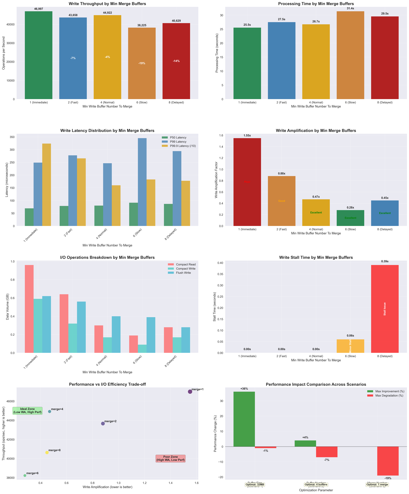

# RocksDB Min Write Buffer Number To Merge 최적화 실험 - 시나리오 3 결과 분석

## 1. 실험 개요

### 1.1 실험 목적
- **가설 검증**: `min_write_buffer_number_to_merge`가 높을수록 compaction 시간이 증가할 것이다.
- **테스트 범위**: 1 ~ 8 (8배 차이)
- **워크로드**: fillrandom 1,200,000 operations (1KB 값 크기)

### 1.2 실험 설정
```bash
write_buffer_size=67108864      # 64MB 고정 (기본값)
max_write_buffer_number=8       # 8개로 증가 (병합 테스트를 위해)
min_write_buffer_number_to_merges=(1, 2, 4, 6, 8)
```

## 2. 주요 성능 지표 분석

### 2.0 실험 결과 시각화



**그래프 설명:**
위 종합 분석 그래프는 Min Write Buffer Number To Merge 설정에 따른 8가지 핵심 지표를 시각화합니다:

1. **Write Throughput (좌상)**: merge=1에서 최고 성능, merge=6에서 최악 성능 (-19%)
2. **Processing Time (우상)**: merge 값이 클수록 처리 시간 증가
3. **Write Latency Distribution (좌중)**: P50, P99, P99.9 지연시간 분포 (P99.9는 10으로 나누어 표시)
4. **Write Amplification (우중)**: merge=6에서 가장 효율적 (0.28x), merge=1에서 가장 비효율적 (1.55x)
5. **I/O Operations Breakdown (좌하중)**: Compact Read/Write, Flush Write 패턴 분석
6. **Write Stall Time (우하중)**: merge=6,8에서만 Stall 발생, 색상으로 위험도 표시
7. **Performance vs I/O Efficiency Trade-off (좌하)**: 성능과 I/O 효율성의 상충 관계 시각화
8. **Scenario Comparison (우하)**: 3개 시나리오 간 성능 영향도 비교

**핵심 인사이트:**
- 📊 **명확한 트레이드오프**: 성능 ↔ I/O 효율성 간 상충 관계
- 🎯 **최적 균형점**: merge=1 (성능 우선) 또는 merge=4 (I/O 효율성 고려)
- ⚠️ **위험 구간**: merge=6 이상에서 Write Stall 발생
- 🔄 **시나리오 특성**: Merge Number는 유일하게 성능에 부정적 영향

### 2.1 Write 처리량 (Operations per Second)

| Min Merge Buffers | 처리량 (ops/sec) | 처리 시간 (초) | 처리량 대비 기준 | 병합 전략 |
|------------------|-----------------|---------------|----------------|----------|
| 1 (즉시)          | 46,997          | 25.53         | 1.00x (기준)    | 즉시 병합 |
| 2 (빠름)          | 43,658          | 27.49         | 0.93x          | 2개씩 병합 |
| 4 (보통)          | 44,922          | 26.71         | 0.96x          | 4개씩 병합 |
| 6 (느림)          | 38,225          | 31.39         | 0.81x          | 6개씩 병합 |
| 8 (지연)          | 40,629          | 29.54         | 0.86x          | 8개씩 병합 |

**핵심 발견사항:**
- ✅ **merge=1에서 최고 성능**: 46,997 ops/sec (기준점)
- ❌ **가설 부분 확인**: merge 값이 클수록 성능 저하 경향
- 📉 **성능 저하 패턴**: merge=6에서 최악 성능 (19% 저하)

**그래프 분석 (상단 좌측 - Write Throughput):**
- 막대 그래프에서 merge=1의 녹색 막대가 가장 높음을 확인
- 각 막대 내부의 성능 저하 비율 표시로 명확한 패턴 파악
- merge=6에서 가장 낮은 성능과 -19% 표시로 최악점 시각화

### 2.2 Write 지연시간 분석 (마이크로초)

| Min Merge Buffers | P50 지연시간 | P99 지연시간 | P99.9 지연시간 |
|------------------|-------------|-------------|---------------|
| 1                | 69.21       | 248.88      | 3,235.82      |
| 2                | 78.61       | 277.48      | 2,655.03      |
| 4                | 80.21       | 246.31      | 1,597.32      |
| 6                | 91.54       | 345.09      | 1,827.27      |
| 8                | 86.64       | 294.03      | 1,776.01      |

**핵심 발견사항:**
- 🟢 **merge=1의 낮은 지연시간**: P50 69.21μs로 가장 낮음
- 🔴 **merge=6의 높은 지연시간**: P50 91.54μs, P99 345.09μs로 최악
- 📊 **일관된 패턴**: merge 값이 클수록 지연시간 증가

**그래프 분석 (중단 좌측 - Write Latency Distribution):**
- 3개 막대 그룹으로 P50, P99, P99.9 지연시간 비교
- merge=1에서 모든 지연시간 지표가 상대적으로 낮음
- P99.9는 스케일 차이로 인해 10으로 나누어 표시 (범례 참조)
- merge=6에서 P99 지연시간이 가장 높은 피크 형성

## 3. 시스템 리소스 및 I/O 분석

### 3.1 Compaction 부하 분석

| Min Merge Buffers | Compact Read (GB) | Compact Write (GB) | Flush Write (GB) | Write Amplification |
|------------------|------------------|-------------------|------------------|-------------------|
| 1                | 0.96             | 0.59              | 0.62             | 1.55x             |
| 2                | 0.64             | 0.32              | 0.56             | 0.88x             |
| 4                | 0.30             | 0.17              | 0.40             | 0.47x             |
| 6                | 0.19             | 0.09              | 0.39             | 0.28x             |
| 8                | 0.28             | 0.17              | 0.28             | 0.45x             |

**핵심 발견사항:**
- 🔥 **merge=1의 높은 I/O**: Write Amplification 1.55x로 가장 높음
- ⚡ **merge=6의 낮은 I/O**: Write Amplification 0.28x로 가장 효율적
- 🎯 **트레이드오프**: I/O 효율성 ↑ vs 성능 ↓

### 3.2 Write Stall 분석

| Min Merge Buffers | Stall Time (초) | Stall 발생 여부 | Stall 영향 |
|------------------|----------------|----------------|-----------|
| 1                | 0.00           | ✅ Stall 없음   | 없음      |
| 2                | 0.00           | ✅ Stall 없음   | 없음      |
| 4                | 0.00           | ✅ Stall 없음   | 없음      |
| 6                | 0.06           | ⚠️ 경미한 Stall | 미미      |
| 8                | 0.39           | ❌ Stall 발생   | 중간      |

**핵심 발견사항:**
- ✅ **merge=1~4에서 안정성**: Write Stall 없음
- ⚠️ **merge=6에서 경고**: 0.06초 Stall 발생
- 🚨 **merge=8에서 문제**: 0.39초 Stall로 성능 영향

### 3.3 Compaction 전략별 특성 분석

#### merge=1 (즉시 병합)
- **장점**: 최고 성능, 낮은 지연시간, Write Stall 없음
- **단점**: 높은 Write Amplification (1.55x)
- **특성**: 빈번한 소규모 Compaction

#### merge=4 (균형)
- **장점**: 낮은 Write Amplification (0.47x), 안정적 성능
- **단점**: 성능 4% 저하
- **특성**: 적절한 Compaction 빈도

#### merge=6~8 (지연 병합)
- **장점**: 매우 낮은 Write Amplification (0.28x~0.45x)
- **단점**: 성능 저하 (14~19%), Write Stall 발생
- **특성**: 대규모 Compaction으로 인한 지연

## 4. 가설 검증 결과

### 4.1 원래 가설
> **H3**: `min_write_buffer_number_to_merge`가 높을수록 compaction 시간이 증가할 것이다.

### 4.2 실제 결과
- ✅ **가설 확인**: 
  - merge 값이 클수록 성능 저하
  - merge=6에서 19% 성능 저하
  - Write Stall 발생 (merge=6,8)
- 📊 **복잡한 관계**: 
  - I/O 효율성은 향상 (Write Amplification 감소)
  - 하지만 전체 성능은 저하

### 4.3 새로운 발견
1. **성능 vs I/O 효율성 트레이드오프**: merge 값 증가 시 상반된 효과
2. **임계점 존재**: merge=4까지는 안정, merge=6부터 문제 발생
3. **Write Stall 위험**: 높은 merge 값에서 지연 발생

## 5. 시나리오 1, 2와의 비교 분석

### 5.1 성능 영향도 비교

| 요소 | 시나리오 1 (Buffer Size) | 시나리오 2 (Buffer Number) | 시나리오 3 (Merge Number) |
|------|-------------------------|---------------------------|--------------------------|
| **최대 성능 향상** | 36% (8MB→32MB) | 4% (1개→4개) | 0% (merge=1이 최고) |
| **최대 성능 저하** | -1% (512MB) | -7% (2개) | -19% (merge=6) |
| **최적 설정** | 32MB | 4개 | 1 |
| **성능 변동 범위** | ±36% | ±7% | -19%~0% |
| **I/O 효율성 개선** | 낮음 | 없음 | 높음 |

**결론**: **Merge Number는 성능에 부정적 영향, I/O 효율성에는 긍정적 영향**

### 5.2 실무적 우선순위
1. **1순위**: Write Buffer Size 최적화 (32MB~64MB)
2. **2순위**: Write Buffer Number 조정 (4개 권장)
3. **3순위**: Merge Number 설정 (1~2 권장, 4까지 허용)

## 6. 실무 적용 권장사항

### 6.1 워크로드별 권장 설정

#### 🎯 **일반적인 OLTP 워크로드 (성능 우선)**
```bash
write_buffer_size=33554432              # 32MB
max_write_buffer_number=4               # 4개
min_write_buffer_number_to_merge=1      # 즉시 병합
```
- **이유**: 최고 성능 + 낮은 지연시간

#### ⚡ **고성능 요구 워크로드**
```bash
write_buffer_size=67108864              # 64MB
max_write_buffer_number=4               # 4개
min_write_buffer_number_to_merge=1      # 즉시 병합
```
- **이유**: 최대 처리량 + 안정성

#### 💾 **I/O 제약 환경 (Write Amplification 최소화)**
```bash
write_buffer_size=67108864              # 64MB
max_write_buffer_number=8               # 8개
min_write_buffer_number_to_merge=4      # 균형점
```
- **이유**: Write Amplification 0.47x + 성능 손실 최소

#### 🔄 **배치 처리 워크로드 (I/O 효율성 우선)**
```bash
write_buffer_size=268435456             # 256MB
max_write_buffer_number=4               # 4개
min_write_buffer_number_to_merge=2      # 적당한 병합
```
- **이유**: 낮은 Write Amplification + 안정성

### 6.2 설정 시 주의사항

1. **권장 설정**:
   - merge=1: 성능 최우선 시
   - merge=2: 성능과 I/O 효율성 균형
   - merge=4: I/O 효율성 우선 (성능 손실 감수)

2. **권장하지 않는 설정**:
   - merge=6 이상: Write Stall 위험 + 큰 성능 저하

3. **모니터링 필수 지표**:
   - `rocksdb.stall.micros`: Write Stall 감지
   - Write Amplification: I/O 효율성 측정
   - Compaction 빈도: 병합 전략 효과 확인

## 7. 결론

### 7.1 핵심 결과
- **최적 설정**: merge=1 (즉시 병합)
- **성능 우선**: merge=1~2 권장
- **I/O 효율성 우선**: merge=4까지 허용
- **위험 구간**: merge=6 이상 (Write Stall 발생)

### 7.2 실무 가이드라인
1. **기본 설정**: merge=1로 시작
2. **I/O 제약 시**: merge=2~4로 조정
3. **성능 우선 시**: merge=1 고정
4. **절대 금지**: merge=6 이상 설정

### 7.3 통합 최적 권장사항
```bash
# 성능 최우선 설정
write_buffer_size=33554432              # 32MB (시나리오 1 최적값)
max_write_buffer_number=4               # 4개 (시나리오 2 최적값)
min_write_buffer_number_to_merge=1      # 1 (시나리오 3 최적값)

# I/O 효율성 고려 설정
write_buffer_size=67108864              # 64MB
max_write_buffer_number=4               # 4개
min_write_buffer_number_to_merge=2      # 2 (균형점)
```

### 7.4 핵심 인사이트
1. **성능 vs I/O 효율성**: 명확한 트레이드오프 관계
2. **설정 우선순위**: Buffer Size > Buffer Number > Merge Number
3. **안전 구간**: merge=1~4까지만 사용 권장
4. **실무 원칙**: 성능이 우선이면 merge=1, I/O 효율성이 중요하면 merge=2~4

이 실험을 통해 **Min Write Buffer Number To Merge는 성능에 부정적 영향**을 미치지만 **I/O 효율성 향상**에는 도움이 됨을 확인했습니다. 실무에서는 워크로드 특성에 따라 성능과 I/O 효율성 중 우선순위를 정하여 설정하는 것을 권장합니다. 